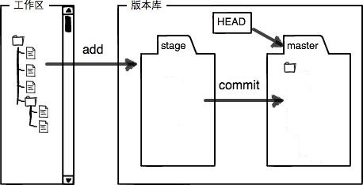
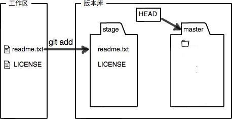

* [图例演示Git工作区和暂存区](#图例演示Git工作区和暂存区)
    * [工作区](#工作区)
    * [版本库](#版本库)
    * [图例演示版本提交的过程](#图例演示版本提交的过程)
# 图例演示Git工作区和暂存区
## 工作区
我们在电脑里的工作文件夹/项目文件夹，就是Git的工作区，比如：


## 版本库
工作区中有个隐藏目录.git，就是Git的版本库了。版本库里存了很多东西，其中最重要的就是成为stage的暂存区。还有Git为我们自动创建的第一个分支`master`，以及指向`master`的一个指针叫`HEAD`。比如：我这个项目里有两个分支：master和temp，那么在.git/refs/heads目录下的master和temp两个文件：


用抽象图演示工作区、版本库、stage以及master和HEAD的关系，如下：


## 图例演示版本提交的过程
接下来，我们用抽象图演示下把文件往Git版本库里添加的过程：
  1. 当我们新创建一个Git工作区的时候，暂存区和master中没有内容：

  
  2. 接下来我们在工作区工作，创建新文件或编辑原有文件。这时暂存区和master分支下依然没有内容。

  
  3. 执行`add`命令，添加改动文件到暂存区,这时暂存区中会添加我们修改过的文件：
  ```
  git add .
  ```

  
  4. 执行`commit`命令，将暂存区内容提交到`master`分支：
  ```
  git commit -m "add readme.txt and LICENSE"
  ```

  

  5. Git的跟踪并管理的是修改，而不是文件。提交到`master`分支以后，实际上Git只是记录的文件的修改，然后调整HEAD指针的位置。
